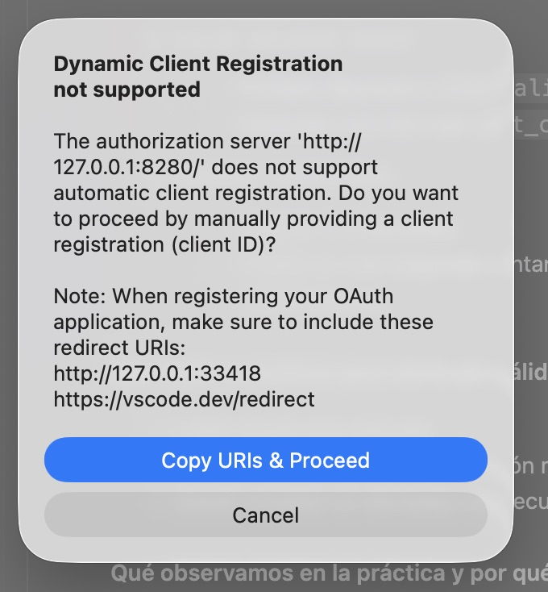
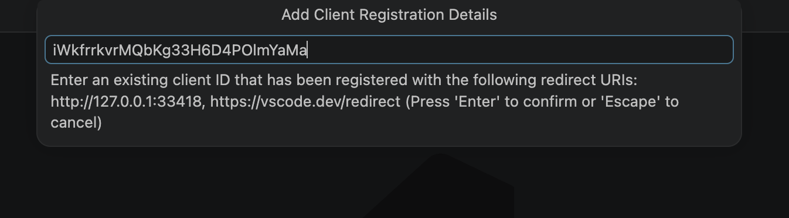
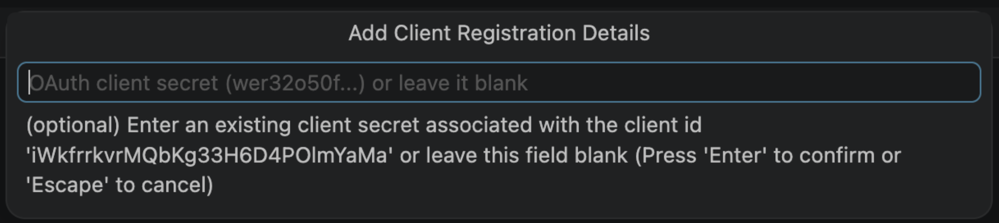

# Acceso seguro con OAuth de usuario (WSO2 APIM + Identity Server)

Este MCP se consume desde VS Code a través del **gateway WSO2 API Manager** protegido con OAuth2, de modo que **cada llamada se autentica con la identidad del usuario** que ha iniciado sesión en el **WSO2 Identity Server (IS)**. 

## 1) Opciones que teníamos para integrar MCP + OAuth en VS Code

### Opción 1: Nativa, la más limpia  (out of the box): VS Code cliente MCP remoto con OAuth directo al gateway

Esta era la opción natural: conectar VS Code directamente al endpoint MCP del APIM y dejar que el cliente MCP resolviera OAuth por sí mismo.

#### Cómo se implementa paso a paso (modo nativo)

1. Preparar backend y gateway.
   - Levantar IS + APIM + Weather backend.
   - Confirmar que el endpoint MCP publicado por APIM responde (ejemplo: `http://127.0.0.1:8280/weather-mcp/1.0.0/mcp`).

2. Configurar VS Code para apuntar directo a APIM.
  - Usar en `.vscode/mcp.json` la entrada `vscode-native-weather-mcp` con URL del gateway.

```jsonc
{
  "servers": {
    "vscode-native-weather-mcp": {
      "type": "http",
      "url": "http://127.0.0.1:8280/weather-mcp/1.0.0/mcp"
    }
  }
}
```

3. Reiniciar el servidor MCP en el IDE.
  - `MCP: List Servers -> vscode-native-weather-mcp -> Restart`.
  - **Aquí es donde falla**, con el aviso *"Dynamic Client Registration not supported"*. 

    1. VS Code prueba a usar una herramienta sin credenciales.

    <div align="center">
      
    </div>

    2. El servidor le contesta: *"necesitas identificarte; quien te puede dar acceso es este otro servidor (el Identity Server)"*. La referencia estándar para ese alta dinámica de clientes es RFC 7591, y de hecho el IS se apoya en ese modelo al publicar un `registration_endpoint`. El problema no es que use otro estándar, sino que en esta configuración no permite el registro dinámico anónimo que VS Code intenta hacer: cuando lo intenta, el IS responde `401 Unauthorized`, así que VS Code no puede darse de alta solo y necesita una aplicación ya creada o un registro previo controlado.
    3. VS Code va a ese Identity Server y le pregunta: *"¿puedo darme de alta yo mismo como aplicación nueva, sin que nadie me haya creado antes?"* — esto es justo lo que significa el aviso: registrarse automáticamente, sin depender de que un humano haya creado esa aplicación de antemano.
    4. El Identity Server, al principio, dice que sí tiene un sitio para eso... pero cuando VS Code intenta darse de alta de verdad, el Identity Server responde *"no, para registrar una aplicación nueva primero tienes que estar ya autenticado"*. Es una contradicción: le habías dicho que podía registrarse solo, pero para hacerlo le pides algo que un recién llegado no puede tener.
    5. Como VS Code no consigue completar ese auto-registro, se rinde y te ofrece la alternativa manual: que le des tú un `client_id` de una aplicación **que ya exista**, en vez de crear una nueva sobre la marcha.

    <div align="center">
      
      
    </div>

    En resumen: no es un fallo de VS Code ni de esta demo — es que este Identity Server, tal como está configurado, **no deja que las aplicaciones se den de alta solas**; solo permite usar aplicaciones que un administrador haya creado antes a mano. Y eso es exactamente lo que hace nuestro proxy (`mcp-oauth-proxy.py`): usa una aplicación ya dada de alta (con su `client_id` y su contraseña guardados en `/tmp/is_mcp_app_creds.txt`) en vez de intentar registrar una nueva.

    Y aunque se le dé a VS Code un `client_id`/`client_secret` de una aplicación ya existente a mano (saltándose el punto anterior), sigue fallando, por un segundo motivo independiente — VS Code no sabe a qué servidor de login llamar:

    6. Antes de pedir ningún dato, VS Code le pregunta al propio gateway de APIM (`127.0.0.1:8280`, que es quien sirve el MCP): *"¿quién da los permisos aquí?"* — es el estándar RFC 9728 ("protected resource metadata"). El gateway responde **404 Not Found**: no expone esa información.
    7. VS Code lo intenta de otra forma, preguntando directamente a esa misma dirección si tiene publicado un `.well-known/oauth-authorization-server` (RFC 8414). También **404**. Esto es justo el aviso que aparece en el log: *"Using default auth metadata"*.
    8. Al no encontrar nada, VS Code se inventa unas URLs por defecto asumiendo que el login (`/authorize`, `/token`) vive en esa misma dirección, `127.0.0.1:8280`. Pero eso es incorrecto: el servidor de identidad de verdad, donde esas rutas sí existen, es otra máquina distinta, `https://localhost:9453` (confirmado con `curl`: ahí sí responde `authorization_endpoint: https://localhost:9453/oauth2/authorize`, etc.).

    Por eso, aunque los datos manuales (`client_id`/`client_secret`) sean correctos, VS Code los usa contra la dirección equivocada (el gateway, no el Identity Server) y el login sigue sin completarse. Son dos fallos encadenados — auto-registro bloqueado (DCR) y descubrimiento de endpoints roto (metadata 404) — y basta con que falle cualquiera de los dos para que el modo nativo no funcione.

4. Forzar llamadas reales.
   - Primero discovery (`initialize`, `tools/list`).
   - Después una tool real (`get_current_weather` o `get_weather_forecast`).

5. Verificar continuidad.
   - Repetir 3-5 llamadas.
   - Probar en una segunda ventana de VS Code para validar comportamiento multiinstancia.

#### Qué debía cumplirse para darla por válida

- Login inicial una sola vez.
- Refresh silencioso sin intervención manual.
- Sesión estable en llamadas consecutivas y en varias ventanas.

#### Qué observamos en la práctica y por qué se descartó

1. **Bug/limitación de certificados en el runtime de VS Code (impacto directo).**
   - En entornos con TLS corporativo o certificados internos, el runtime Node de VS Code no siempre confía automáticamente en la misma cadena CA que el navegador/sistema.
   - Impacto: errores TLS durante authorize/token/discovery (`SELF_SIGNED_CERT_IN_CHAIN`, `UNABLE_TO_GET_ISSUER_CERT_LOCALLY` o equivalentes), aunque en navegador parezca correcto.
   - Mitigación necesaria en modo nativo: exportar CA corporativa e inyectarla con `NODE_EXTRA_CA_CERTS` antes de arrancar VS Code/proceso MCP.
   - Problema operativo: esta mitigación es manual, dependiente de cada máquina y poco amigable para un equipo grande.


2. **VS Code no puede darse de alta solo (Dynamic Client Registration).**
  - Detalle completo, con la explicación paso a paso de qué intenta VS Code y por qué el Identity Server lo rechaza, en el paso 3 de *"Cómo se implementa paso a paso"* más arriba.
  - Evidencia técnica (para quien quiera verificarlo): el Identity Server anuncia un `registration_endpoint` en su metadata RFC 8414 (`https://localhost:9453/api/identity/oauth2/dcr/v1.1/register`), pero una petición de registro anónima contra ese endpoint devuelve `401 Unauthorized — "AuthenticationHandler not found"`. Eso demuestra que, en esta configuración, el IS no acepta el alta dinámica anónima que VS Code intenta hacer.

6. **Descubrimiento de endpoints OAuth roto en el gateway (impide incluso el `client_id` manual).**
   - Aunque se le dé a VS Code un `client_id`/`client_secret` de una aplicación ya existente para saltarse el DCR, el login sigue sin completarse.
   - Motivo: VS Code espera que el propio gateway de APIM (`127.0.0.1:8280`, el "resource server" del MCP) publique metadata RFC 9728 (`/.well-known/oauth-protected-resource`) o RFC 8414 (`/.well-known/oauth-authorization-server`) indicando dónde está el verdadero servidor de identidad. Al no encontrar ninguna de las dos, VS Code cae a *"default auth metadata"* y asume — incorrectamente — que `/authorize` y `/token` viven en esa misma dirección `127.0.0.1:8280`, en vez de en `https://localhost:9453` (el Identity Server real).
   - Evidencia técnica: `curl http://127.0.0.1:8280/.well-known/oauth-protected-resource` y `curl http://127.0.0.1:8280/.well-known/oauth-authorization-server` devuelven ambos `404 Not Found` contra el gateway; en cambio `https://localhost:9453/oauth2/token/.well-known/openid-configuration` sí responde con los endpoints correctos (`authorization_endpoint: https://localhost:9453/oauth2/authorize`, etc.).
   - Consecuencia: aunque los datos manuales sean correctos, VS Code los usa contra la dirección equivocada. Este fallo es independiente del punto 5 (DCR) — basta con que ocurra cualquiera de los dos para que el modo nativo no funcione.

#### Conclusión de la opción 1

Aunque era la opción ideal "out of the box", en nuestro escenario real no cumplió el criterio de robustez ni de experiencia de usuario para el equipo.

### Opción 2  proxy local OAuth delante del gateway

La decisión fue mover la complejidad OAuth fuera del IDE y centralizarla en un proxy local (`mcp-oauth-proxy.py`). VS Code solo habla HTTP MCP contra `127.0.0.1:9096`.

#### Por qué esta opción es mejor

- El IDE deja de depender de estados internos de OAuth/tokens.
- El proxy controla el ciclo completo: authorize, callback, token, refresh, relogin.
- Se evita el efecto de inestabilidad por 401 tardío dentro del cliente MCP nativo.
- Se simplifica la operación para cualquier técnico: misma URL local, mismo flujo, menos variables por máquina.

#### Implementación reproducible para cualquier técnico del equipo (paso a paso: qué hacer y por qué)

1. Arrancar servicios base (IS + APIM + backend Weather).
  - Qué hacer: levantar primero la plataforma y confirmar que el backend responde.
  - Por qué: el proxy no sustituye a APIM/IS; solo orquesta OAuth entre VS Code y esos servicios.

2. Arrancar el proxy local y verificar que queda en running.

```sh
./weather-mcp-proxy.sh start
./weather-mcp-proxy.sh status
```

  - Qué hacer: iniciar el proxy antes de abrir pruebas desde el IDE.
  - Por qué: VS Code hablará solo con `127.0.0.1:9096`; si el proxy no está activo, no hay sesión MCP utilizable.

3. Configurar VS Code para usar el proxy (no el gateway directo).
  - Qué hacer: mantener en `.vscode/mcp.json` la entrada `weather-mcp` apuntando a `127.0.0.1:9096`.
  - Por qué: así el IDE evita la fragilidad del modo nativo y delega en el proxy todo el ciclo OAuth.

```jsonc
{
  "servers": {
   "weather-mcp": {
    "type": "http",
    "url": "http://127.0.0.1:9096/weather-mcp/1.0.0/mcp"
   }
  }
}
```

4. Reiniciar conexión MCP en VS Code.
  - Qué hacer: `MCP: List Servers -> weather-mcp -> Restart`.
  - Por qué: fuerza a VS Code a recargar `mcp.json` y reconectar con la URL local correcta.

5. Ejecutar una tool real desde Copilot Agent.
  - Qué hacer: lanzar una petición como `dime el tiempo en madrid`.
  - Por qué: el login se dispara cuando realmente hace falta (primera `tools/call` protegida), no durante el arranque.

6. Validar identidad de usuario en la respuesta.
  - Qué hacer: confirmar en salida de tool `Hola <usuario>`.
  - Por qué: valida que el token es de usuario final y no una credencial técnica genérica.

7. Probar relogin/cambio de usuario.

```sh
open http://127.0.0.1:9096/relogin
```

  - Qué hacer: forzar re-login y repetir una llamada MCP.
  - Por qué: comprueba que el flujo soporta cambio de identidad sin reconfigurar el IDE.

8. Probar estabilidad con varias llamadas seguidas.
  - Qué hacer: repetir llamadas consecutivas y, si procede, en otra ventana de VS Code.
  - Por qué: valida continuidad de sesión y refresh de tokens en un uso real del equipo.


## 1) Resumen de decisión técnica

- Se descartó el modo nativo para este caso por inestabilidad con 401 tardío, callback OAuth local no determinista y fricción extra por certificados en VS Code.
- Se adoptó proxy local por robustez, repetibilidad y menor coste operativo para el equipo.
- El control de seguridad sigue en APIM (validación JWT/suscripción); el proxy solo orquesta OAuth de usuario de forma fiable para el IDE.


## Autenticación 

El proxy **arranca y escucha al instante, sin autenticar nada**. El login (o el refresh silencioso) se dispara **la primera vez que se invoca de verdad una herramienta**, no al lanzar `weather-mcp-proxy.sh start`. Esto no es una elección arbitraria: es lo que marca la [especificación de autorización de MCP](https://modelcontextprotocol.io/specification/2025-06-18/basic/authorization), cuyo flujo canónico es:

```
Cliente → petición MCP sin token → Servidor → 401 Unauthorized → (ahí, y solo ahí, arranca el descubrimiento OAuth)
```

En la práctica esto significa:
- `initialize` y `tools/list` se reenvían **sin cabecera `Authorization`** — el gateway ya las deja pasar sin token, así que VS Code descubre el servidor y sus herramientas al instante.
- Solo cuando el gateway responde **401 de verdad** (en el primer `tools/call`), el proxy intenta primero un **refresh silencioso** con el `refresh_token` guardado y, si no hay o falla, **entonces** abre el navegador con el login del IS.
- Una primera versión de este proxy sí forzaba el login nada más arrancar (`ensure_token()` antes de escuchar). Se corrigió para ajustarse al spec y porque no tiene sentido pedir credenciales antes de saber si el usuario va a usar el MCP.

## Ciclo de vida de los tokens (¿cuándo hay que volver a hacer login?)

Configurado en la app OAuth del IS (`Applications → VSCode-Copilot - WeatherMCP → Protocol`, campos *User Access Token Expiry Time* y *Refresh Token Expiry Time*; también editable vía API: `PUT /api/server/v1/applications/{id}/inbound-protocols/oidc`):

| Token | Duración | ¿Qué pasa al caducar? |
|---|---|---|
| `access_token` | **15 minutos** | El proxy lo renueva **solo, en silencio**, con el `refresh_token` — no hace falta volver a autenticarse. |
| `refresh_token` | **1 hora fija desde el login**, sin sine die | Cuando también caduca, la siguiente petición fuerza un login real (pantalla de usuario/contraseña). |

Es importante no confundir esto con una ventana que se renueva sola: la app OAuth del IS tiene `renewRefreshToken: false`, así que WSO2 **no emite un `refresh_token` nuevo en cada uso** — siempre devuelve el mismo, con su expiración original. Verificado empíricamente (dos refrescos consecutivos devuelven idéntico `refresh_token`). Por tanto:

- **Esperar 15 min sin usar el MCP** → transparente, el siguiente uso renueva el token solo.
- **Esperar 1h desde el último login** → el `refresh_token` ya no vale, y la siguiente petición real dispara el login de nuevo.
- Para forzar el re-login **sin esperar a que caduque nada** (p. ej. para cambiar de usuario en plena demo), ver *"Forzar que se vuelva a pedir el login"* más abajo.

> Estos valores (15 min / 1h) son deliberadamente cortos para que la demo pueda mostrar el re-login sin tener que esperar mucho. Los valores por defecto de WSO2 son 1h de access y 24h de refresh; para un entorno real conviene volver a esos valores (o incluso más restrictivos), no a los de esta demo.

## Cómo se ve la identidad del usuario

Para poder **verificar de un vistazo quién está autenticado**, el proxy antepone `Hola <usuario>` al texto que devuelven las herramientas. El nombre **no está fijado en el código**: sale del claim `sub` del token (configurado en el IS como el *username*), así que **cambia según quién haga login** (admin, rafa, …). La prueba infalible es desplegar el bloque *"Ran `get_current_weather`"* en el chat: ahí se ve la salida cruda con el saludo, aunque Copilot lo resuma a su manera.

## Puesta en marcha

Requisitos: el stack WSO2 (APIM + IS) arrancado y el fichero de credenciales del cliente OAuth en `/tmp/is_mcp_app_creds.txt` (formato `clientId:clientSecret`).

```sh
# Arrancar el proxy (arranca al instante; NO pide login todavía)
./weather-mcp-proxy.sh start

# Otros comandos
./weather-mcp-proxy.sh status     # ver si está vivo
./weather-mcp-proxy.sh stop       # pararlo
./weather-mcp-proxy.sh restart    # reiniciarlo
./weather-mcp-proxy.sh login      # arranca; en el PRIMER uso real de una tool
                                   # fuerza la pantalla de login (en vez de SSO)
```

Después, en VS Code: **MCP: List Servers → weather-mcp → Restart** y pide el tiempo en el chat — **ahí** (no antes) se abrirá el navegador con el login del IS.

### Forzar que se vuelva a pedir el login (cambiar de usuario)

```sh
# opción 1: reiniciar forzando la pantalla de credenciales
./weather-mcp-proxy.sh login

# opción 2: sin reiniciar, abrir el endpoint de re-login del proxy
open http://127.0.0.1:9096/relogin
```

> Si el navegador conserva la sesión SSO / "recuérdame", puede autocompletar sin pedir contraseña. Para ver el cambio de usuario con seguridad, usa una ventana de incógnito o cierra antes la sesión del IS.

> Nota: como el `refresh_token` **no rota** (`renewRefreshToken: false` en el IS — el mismo token se reutiliza hasta su expiración fija de 24h), forzar el re-login no lo invalida por sí solo; por eso `/relogin` cierra también la sesión OIDC antes de reabrir el formulario.

## Cómo meter el MCP dentro del IDE (VS Code) paso a paso

Esta sección describe el proceso completo para que el MCP aparezca y funcione dentro de VS Code con Copilot en modo Agent.

### 1) Prerrequisitos

- VS Code actualizado con GitHub Copilot habilitado.
- Stack WSO2 levantado (APIM + IS) y backend Weather disponible.
- Proxy local operativo (modo recomendado en esta demo):

```sh
./weather-mcp-proxy.sh start
./weather-mcp-proxy.sh status
```

### 2) Crear la configuración MCP del workspace

En la carpeta del proyecto, crea/edita `.vscode/mcp.json` con este contenido:

```jsonc
{
  "servers": {
    "weather-mcp": {
      "type": "http",
      "url": "http://127.0.0.1:9096/weather-mcp/1.0.0/mcp"
    },
    "vscode-native-weather-mcp": {
      "type": "http",
      "url": "http://127.0.0.1:8280/weather-mcp/1.0.0/mcp"
    }
  }
}
```

Notas:
- `weather-mcp`: usa proxy local (`127.0.0.1:9096`) y es el modo recomendado para operación diaria.
- `vscode-native-weather-mcp`: conecta directo a APIM (`127.0.0.1:8280`) para pruebas nativas comparativas.
- `type: "http"` indica transporte MCP remoto por HTTP en ambos casos.

### 3) Recargar el servidor MCP dentro de VS Code

1. Abre la paleta de comandos (`Cmd+Shift+P`).
2. Ejecuta `MCP: List Servers`.
3. Selecciona `weather-mcp`.
4. Pulsa `Restart`.

Con eso VS Code vuelve a leer `mcp.json` y reconecta con el endpoint MCP.

### 4) Verificar que el IDE ve las tools

1. Abre Copilot Chat en modo Agent.
2. Lanza una petición real, por ejemplo: `dime el tiempo en madrid`.
3. Comprueba en el bloque de ejecución que se invoca una tool (`get_current_weather` o `get_weather_forecast`).

Si el flujo OAuth necesita login, el navegador se abrirá cuando toque (normalmente en la primera `tools/call` real).

### 5) Verificar identidad de usuario dentro del IDE

- En la salida cruda de la tool debe aparecer saludo del usuario autenticado (`Hola <usuario>`).
- Esto confirma que VS Code está consumiendo el MCP con identidad de usuario y no con credenciales genéricas de aplicación.

### 6) Forzar re-login sin romper la sesión del IDE

Si necesitas cambiar de usuario durante la demo:

```sh
open http://127.0.0.1:9096/relogin
```

Después, vuelve al chat y haz otra llamada de tool para confirmar que cambia el usuario autenticado.

## Anatomía técnica del proxy (detalle interno)

### Cómo funciona el proxy por dentro (secciones y funciones, y por qué existe cada una)

Este bloque aterriza el fichero `mcp-oauth-proxy.py` para que se entienda no solo el "qué hace", sino también **por qué está diseñado así**.

1. **Configuración y estado global**
  - Qué hay: constantes como `LISTEN_HOST/LISTEN_PORT`, `GATEWAY_HOST/GATEWAY_PORT`, `IS_HOST/IS_PORT`, `REDIRECT_URI`, `SCOPE`, `CA_BUNDLE`, `CREDS_FILE` y `REFRESH_MARGIN`; además del estado `_tok` y el lock `_lock`.
  - Por qué: separa claramente los tres mundos (IDE local, gateway APIM e Identity Server) y mantiene en memoria el estado mínimo de sesión para poder hacer refresh sin re-login continuo.

2. **Carga de credenciales y contexto TLS**
  - Funciones: `_creds()`, `_is_ctx()`, `_basic()`.
  - Qué hacen: leen `client_id:client_secret`, construyen el contexto TLS con CA explícita y generan cabecera Basic para `/oauth2/token`.
  - Por qué: evita depender del truststore implícito del runtime de VS Code/Node y hace el flujo reproducible en entornos con CA corporativa o certificados internos.

3. **Intercambio de tokens con el IS**
  - Función: `_post_token(params)`.
  - Qué hace: encapsula la llamada HTTPs al token endpoint para `authorization_code` y `refresh_token`.
  - Por qué: concentrar el intercambio OAuth en una sola función reduce errores y facilita depurar respuestas del IS.

4. **Persistencia de sesión de usuario en memoria**
  - Función: `_store(data)`.
  - Qué hace: guarda `access_token`, `refresh_token`, vencimiento e identidad de usuario (`sub` desde `id_token`).
  - Por qué: permite saber quién está autenticado y decidir en cada request si hay token válido o hay que renovar/reautenticar.

5. **Login interactivo y logout forzado de navegador**
  - Funciones: `_browser_logout()`, `_interactive_login(force=False)`.
  - Qué hacen: cuando hay `force`, limpian sesión OIDC en navegador; luego lanzan `authorization_code + PKCE`, levantan callback local en `:9696`, validan `state` y canjean `code` por tokens.
  - Por qué: garantiza login de **usuario humano** (no de app) y permite demos/control de cambio de usuario sin reiniciar todo el stack.

6. **Política de autenticación perezosa (lazy auth)**
  - Funciones: `_cached_token()`, `ensure_token(force_login=False)`, `_consume_startup_force_login()`.
  - Qué hacen: primero intentan usar cache sin red; solo si hay 401 real del gateway disparan refresh o login; el flag `--login` se consume una sola vez.
  - Por qué: sigue el flujo recomendado por MCP (petición sin token -> 401 -> OAuth) y evita pedir credenciales al arrancar cuando aún no hace falta.

7. **Reenvío HTTP al gateway con reintento controlado**
  - Clase/método: `Handler._forward()`.
  - Qué hace: reenvía la request tal cual al gateway, filtra cabeceras hop-by-hop, mete `Authorization` si hay token, y si llega 401 en primer intento fuerza segundo intento autenticando.
  - Por qué: desacopla al IDE de toda la complejidad OAuth y convierte la autenticación en una responsabilidad del proxy, de forma determinista.

8. **Endpoint operativo de re-login sin reinicio**
  - Clase/método: `Handler._relogin()` expuesto en `/relogin`.
  - Qué hace: fuerza un login interactivo nuevo y devuelve confirmación con usuario actual.
  - Por qué: útil para demos, soporte y cambio de identidad sin tocar configuración de VS Code.

9. **Inyección de saludo/identidad en respuestas MCP**
  - Función: `_inject_greeting(raw, user)`.
  - Qué hace: modifica respuestas JSON/SSE para anteponer contexto `Hola <usuario>` en outputs de tools.
  - Por qué: deja trazabilidad visible de qué identidad real está ejecutando la llamada, evitando confusión en pruebas multiusuario.

10. **Arranque del servidor del proxy**
  - Bloque `if __name__ == "__main__":` con `ThreadingHTTPServer` en `127.0.0.1:9096`.
  - Qué hace: levanta listener local inmediatamente, sin preautenticación.
  - Por qué: prioriza disponibilidad instantánea del MCP en VS Code y retrasa OAuth hasta que realmente se necesita.

### Flujo completo de una llamada (resumen operativo)

1. VS Code llama al proxy en `127.0.0.1:9096`.
2. El proxy reenvía al gateway con token en cache si existe; si no, sin `Authorization`.
3. Si el gateway acepta (p. ej. `initialize`/`tools/list`), responde sin login.
4. Si el gateway devuelve 401 en una tool protegida, el proxy activa `ensure_token()`.
5. El proxy intenta refresh; si no puede, abre navegador y hace login PKCE.
6. Guarda tokens, repite la request, y devuelve resultado al IDE.
7. La salida incluye el usuario autenticado para validación rápida en chat.


